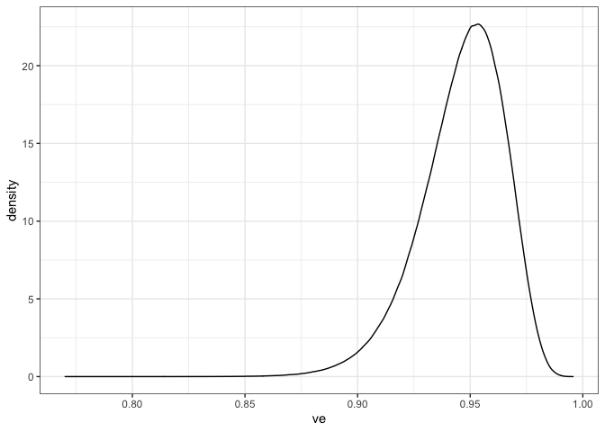

### Interpreting Pfizer’s results

The goal of the below is to show plausible point estimates and 95%
credible intervals based on the protocol-specified prior for Pfizer.
This is informative, both for determining the likely vaccine/placebo
split observed (which was not detailed in [Pfizer’s press
release](https://www.pfizer.com/news/press-release/press-release-detail/pfizer-and-biontech-announce-vaccine-candidate-against))
and for showing the uncertainty (credible intervals) that they are
likely to report.

Because randomization is 1:1 in Pfizer’s protocol, VE can be
approximated as follows: given N observed study endpoints (in this case,
symptomatic COVID-19 disease), VE \~ 1 - v/p, where v is the number of
endpoints observed in the vaccine arm and p is the number in the placebo
arm. In Pfizer’s protocol, they specify a Beta(a, b) prior for theta =
(1-VE) / (2-VE), where a = 0.700102 and b = 1. Note that theta = v /
(v+p) describes the proportion of the N = v + p endpoints that received
the vaccine. We can also do some algebra and find that VE = (1 - 2
theta) / (1 - theta); this is relevant for the computations below.

Now, Pfizer reported VE of “greater than 90%”, which is pretty
ambiguous, particularly because their protocol does not specify (or I
couldn’t find it\!) how they will summarize their posterior distribution
to obtain a point estimate. Let’s assume that they are specifying the
posterior mean of VE for their point estimate and a central credible
interval for their uncertainty. For the credible interval, I am
reporting a central 99.5% interval. Again, this is guessing, but the
protocol specifies that interim hypothesis tests are based on posterior
probability that VE \> 30 given the data being \> 0.995, so could make
sense to report this level. Then again, they changed their interim
monitoring plan based on feedback from FDA, so really, who knows what
they’ll report.

We can compute a point estimate and credible interval for VE as
follows.\[1\]

``` r
# from protocol pg. 111
# https://pfe-pfizercom-d8-prod.s3.amazonaws.com/2020-11/C4591001_Clinical_Protocol_Nov2020.pdf
a <- 0.700102
b <- 1
ci_level <- 0.995

# from press release
total_cases <- 94

# probably a smarter way to do this
prettify <- function(pt_est, ci){
    paste0(sprintf("%.3f", pt_est), " (", 
           sprintf("%.3f", ci[1]), ", ", 
           sprintf("%.3f", ci[2]), ")")
}

# figure out pt est and credible interval
vax_cases <- 1:10
pt_est_ci <- rep(NA, length(vax_cases))
for(v in vax_cases){
    p <- total_cases - v
    # posterior beta dist. parameters
    alpha_v <- a + v
    beta_v <- b + p
    theta_post_samps <- rbeta(5e6, alpha_v, beta_v)
    ve_post_samps <- (1 - 2*theta_post_samps) / (1 - theta_post_samps)
    pt_est <- mean(ve_post_samps)
    ci <- quantile(ve_post_samps, c((1 - ci_level)/2, 1 - (1 - ci_level)/2))
    pt_est_ci[v] <- prettify(pt_est, ci)
}

knitr::kable(cbind(vax_cases, pt_est_ci), row.names = FALSE,
             col.names = c("Vax cases", 
                           paste0("VE (", ci_level*100, "% CI)")))
```

| Vax cases | VE (99.5% CI)        |
| :-------- | :------------------- |
| 1         | 0.982 (0.916, 1.000) |
| 2         | 0.971 (0.893, 0.998) |
| 3         | 0.959 (0.871, 0.995) |
| 4         | 0.948 (0.849, 0.991) |
| 5         | 0.936 (0.828, 0.987) |
| 6         | 0.924 (0.806, 0.982) |
| 7         | 0.912 (0.785, 0.976) |
| 8         | 0.899 (0.763, 0.970) |
| 9         | 0.886 (0.742, 0.964) |
| 10        | 0.873 (0.720, 0.957) |

So if this is indeed how Pfizer is reporting, then the likely case split
given the language in the press announcement seems to be 7 (or 8)
vaccine cases and 87 (or 86) placebo. The credible intervals are also
informative that we have high posterior belief under Pfizer’s prior that
VE is really high.

### Update based on full results

Since interim results above, Pfizer reported results based on 170
COVID-19 disease endpoints with 162:8 placebo:vaccine split. We can
compute the posterior distribution for VE based on these results and
their protocol-specified prior.

``` r
total_cases_full <- 170
v <- 8
p <- total_cases_full - v
# specified in protocol for final analysis
ci_level_full <- 0.986
# posterior beta dist. parameters
alpha_v <- a + v
beta_v <- b + p
theta_post_samps <- rbeta(5e6, alpha_v, beta_v)
ve_post_samps <- (1 - 2*theta_post_samps) / (1 - theta_post_samps)
pt_est <- mean(ve_post_samps)
ci <- quantile(ve_post_samps, c((1 - ci_level)/2, 1 - (1 - ci_level)/2))
```

The results indicate an estimate VE (98.6% credible interval) of 0.946
(0.878, 0.984).

Here is the full posterior distribution.

``` r
ve_dat <- data.frame(ve = ve_post_samps)
library(ggplot2)
ggplot(ve_dat, aes(ve)) + 
  geom_density() + theme_bw()
```

<!-- -->

1.  Below, I’m being lazy and using a numeric approximation to the
    posterior mean of VE; maybe there’s an analytic solution, but I’m
    too lazy at this moment to figure it out 🙃.
